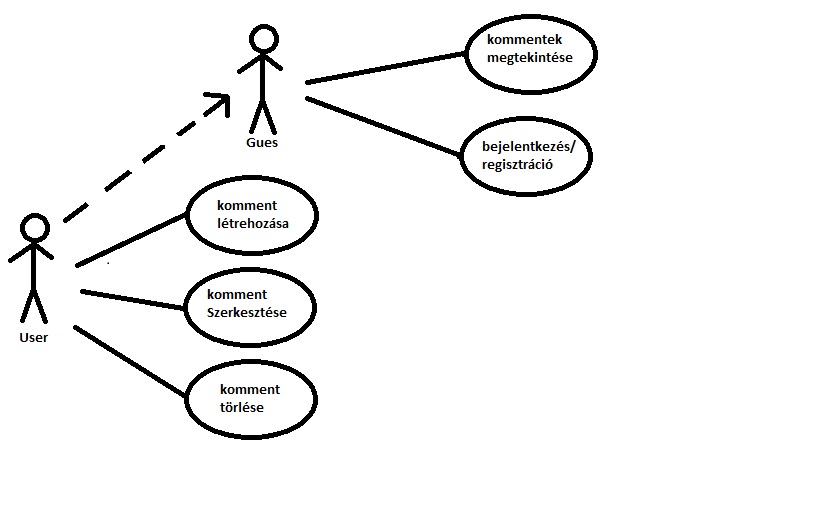
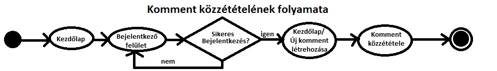
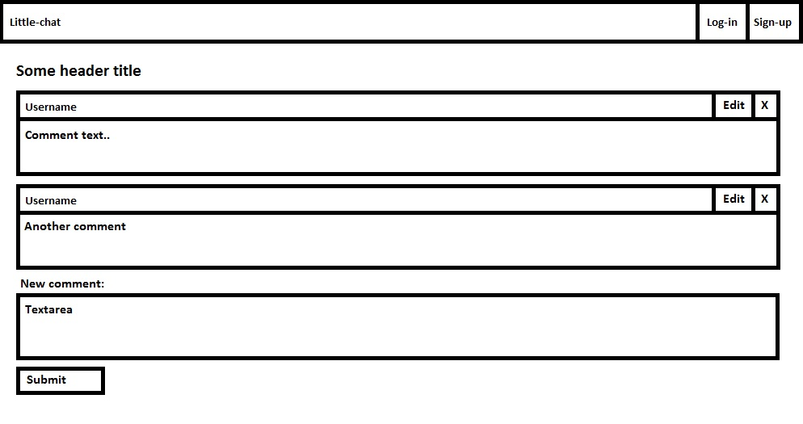
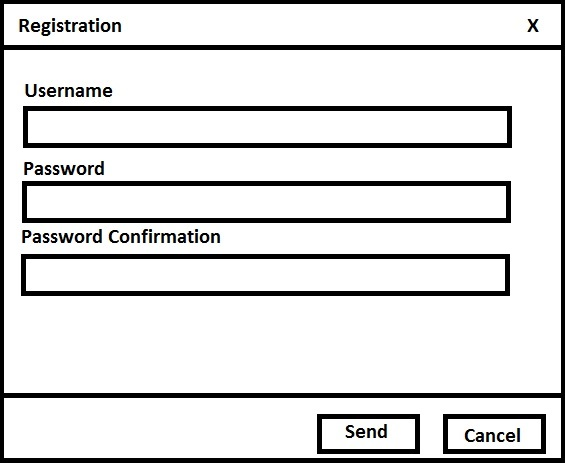
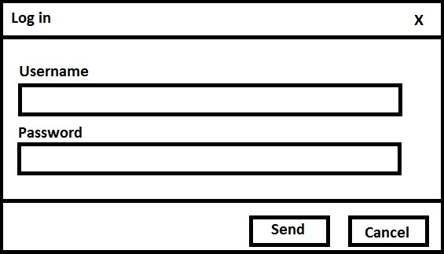
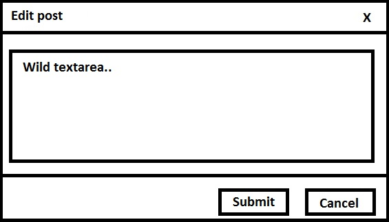
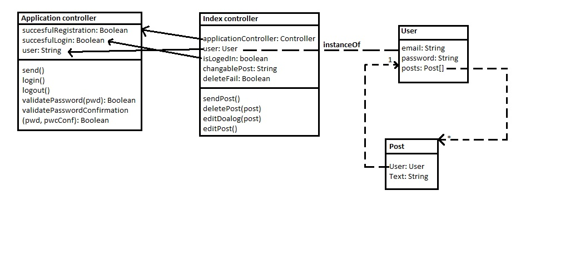

This is a project work, made for one of my university's lecture. It is a simple forum, made with EmberJS (client) and NodeJS (server). The server and the client is communicate over REST API.

Ez egy egyetemi beadandóra készített form szerű webes alkalmazás. A klins EmberJS-el míg a szerver NodeJs-el készült és a kettő REST API segítségével kommunikál

#Dokumentáció

##Követelmények

###Célkitűzés
A project fő célja egy minimalista forum felület megvalósítása ami teljesen mobil barát.

###Funkcionális elvárások
####Felhasználói szemszögből
* Felhasználóként szeretném megnézni az oldalt és látni az eddig létrehozott kommenteket hogy megtudjam, érdemes-e regisztrálnom
* Felhasználóként szeretnék tudni regisztrálni/ bejelentkezni
* Felhasználóként szeretnék tudni a bejelentkezés után új kommentet felvinni
* Felhasználóként szeretném módosítani illetve törölni a régebbi, saját kommentjeimet

###Nem funkcionális követelmények
* Felhasználóbarát, mobile-friendli ergonomikus design
* Gyors működés
* Biztonságos működés

###Szerepkörök
**vendég**: meg tudja tekinteni a főoldalt, és a már mások által létrehozott kommenteket

**felhasználó**: a vendék körét bővíti ki kommentet létrehozásának, modosításának és törlésének lehetősőgővel

###Használati esetek

###Folyamatábra


##Tervezés

###Architectura terv
####Oldaltérkép
Publikus:

- index

Felhasználó:

- regisztrációs modal ablak
- bejelentkező modal ablak
- komment módosítása modal ablak


####Végpontok
#####Front-end végpontok

* GET  /index

#####Back-end (REST-API) végpontok

* GET /users
* GET /user/:id
* POST /users
* GET /posts
* GET /post/:id
* POST /posts
* PUT /post/:id
* DELETE /post/:id

###Felhasználóifelület-modell
####Oldalvázlatok
(A kezdőlapon kívül minden funkciót modal ablakok valósítanak meg)

Kezdőlap

Regisztráció

Bejelentkezés

Komment módosítása


###Osztálymodell


##Implementáció
###Fejlesztői környezet
Az alkalmazást a cloud9 fejlesztői környezet segítségével fejlesztettem
###Könyvtárstruktúra
A teljes könyvtárstruktúrát feleslegesnek tartom felvázolni, az Ember.js rengeteg mappát és file-t hoz létre saját aminek működését most nem tárgyalom
- **docs** ide kerülnek a dokumentumok
  - **images** ide kerülnek a dokumentumokhoz tartozó képek
- **app**
  - **pods**
    - **application**
      - **controller.js**
      - **adapter.js**
    - **index**
     - **template.hbs**
     - **controller.js**
     - **route.js**
    - **user**
      - **model.js**
    - **post**
      - **model.js**
  - **style**
    - **app.css**

A REST API NeDB-t használ az adatok tárolására ami egy lightweight fájl alapú adatbázis

##Tesztek
###Unit tesztek
Mivel a Back-end szinte kizárólag a fortune.js-t haszálja ami már tesztelve van így nem láttam értelmét tesztek írásának

##Felhasználói dokumentáció

###Telepítés
####Dependenciák
- git
- npm
- nodejs
- bower
- ember-cli

####Telepítés
Először a git segítségével egy másolatot kell készíteni az kliensrő és a szerverről róla helyi PC-n. Ez a következő parancsal történi:
```
git clone https://github.com/martin4955/ember-chat-project.git
```
Ezután be kell lépni először a server majd a client mappába és kiadni az `npm istall` parancsot ami telepíti a szükséges dependenciáka.
Majd a client mappában a `bower install` parancsal telepíteni kell a javascript és css dependenciákat is.
Ha minden megvan akkor cmd-ből vagy terminálból be kell lépni a server mappába és lefuttani a `node server.js` parancsot, ezzel elindítjuk a REST szervert. Végül a client mappába el kell indítani `ember serve` parancsal a Front-end szerverünket is.
###Használat
A felhasználó megtekintheti az eddig létrehozott kommenteket, regisztráció ill. bejelentkezés után létrehozhat sajátokat, amiket késöbb módosíthat, vagy törölhet is.
